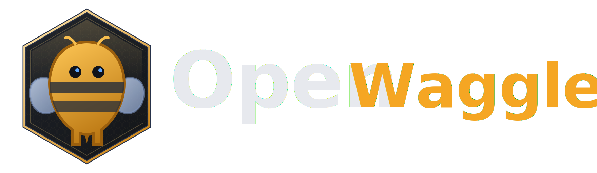

<p align="center">
  
</p>

<p align="center">
  <strong>A desktop coding agent that pairs AI models to solve problems together.</strong>
</p>

<p align="center">
  
  
  
  
</p>

---

## What is OpenWaggle?

In nature, honeybees don't solve problems alone — they waggle.

When a forager bee discovers nectar, it doesn't keep the knowledge to itself. It returns to the hive and performs a **waggle dance**: a figure-eight that encodes direction, distance, and quality. Other bees read the dance, verify the source, and the colony converges on the best path forward. No single bee has the full picture, but through structured communication the hive finds the optimal outcome every time.

OpenWaggle works the same way. It's a desktop coding agent that connects to multiple AI providers — Anthropic, OpenAI, Gemini, Grok, OpenRouter, and Ollama — and lets you **pair two models on the same problem**. Give them roles, give them a task, and watch them waggle: trading context, challenging each other's assumptions, and converging on solutions no single model would reach alone.

- **Multi-model, multi-provider** — Switch between 6 providers and dozens of models without leaving the app
- **Waggle Mode** — Pair two AI agents with different strengths and let them collaborate in structured turns
- **Full coding agent** — File operations, shell commands, browser automation, and git integration built in
- **Local-first** — Your conversations, settings, and API keys stay on your machine

## Features

### Multi-Model Support

Connect to **6 providers** out of the box. Bring your own API keys or authenticate via OAuth for supported subscriptions.

| Provider | Auth | Local |
|----------|------|-------|
| Anthropic | API key / OAuth | |
| OpenAI | API key / OAuth | |
| Google Gemini | API key | |
| Grok (xAI) | API key | |
| OpenRouter | API key | |
| Ollama | None (local) | Yes |

### Waggle Mode

The flagship feature. Pair two AI agents, configure their roles, and let them collaborate:

- **Sequential turns** — agents take turns, each building on the other's work
- **Parallel mode** — both agents tackle the problem simultaneously, then synthesize
- **Consensus detection** — automatically stops when agents converge on a solution
- **Manual stop** — take back control at any time
- **Team presets** — save your favorite agent pairings (3 built-in, unlimited custom)
- **Conflict tracking** — warns when agents edit the same files

Open Settings > Waggle Mode to configure teams, or use the command palette (`Ctrl+K` / `Cmd+K`) and search for "waggle" to start a session.

### Built-in Agent Tools

The agent comes equipped with tools for real development work:

- **File operations** — read, write, edit, glob, list files
- **Shell commands** — execute commands in your project directory
- **Skills system** — extensible agent behaviors via `.openwaggle/skills/`
- **Ask user** — the agent can ask clarifying questions mid-run

Write, edit, and shell commands require explicit approval before execution (configurable per session).

### Git Integration

- **Live diff stats** — see changed files and line counts in real time
- **Branch management** — switch, create, and manage branches from the header
- **Commit dialog** — stage files, write messages, and commit without leaving the app
- **Diff panel** — side-by-side view of all working tree changes

### Rich Input

- **Attachments** — drag and drop text files, PDFs, and images (with OCR extraction)
- **Voice input** — local Whisper transcription (no audio leaves your machine)
- **Slash commands** — type `/` to discover and activate skills inline

### Built-in Terminal

Full PTY terminal emulation powered by xterm.js. Toggle with `Ctrl+J` / `Cmd+J`.

## Quick Start

### Prerequisites

- [Node.js](https://nodejs.org/) 24.x
- [pnpm](https://pnpm.io/) 9+

### Install and run

```bash
git clone https://github.com/OpenWaggle/OpenWaggle.git
cd openwaggle
pnpm install
pnpm dev
```

### Configure providers

1. Open **Settings** (gear icon or `Cmd+,`)
2. Go to **Connections**
3. Add API keys for your providers (or use OAuth for Anthropic/OpenAI subscriptions)
4. Select your default model from the model picker in the header

## Configuring Providers

| Provider | Auth Method | Custom Base URL | Subscription OAuth |
|----------|------------|-----------------|-------------------|
| Anthropic | API key | Yes | Yes |
| OpenAI | API key | Yes | Yes |
| Google Gemini | API key | Yes | No |
| Grok (xAI) | API key | Yes | No |
| OpenRouter | API key | No | No |
| Ollama | None | Yes (default: localhost:11434) | No |

API keys and app settings are stored locally in OpenWaggle's SQLite app database in your OS config directory. They never leave your machine.

## Using OpenWaggle

### Chat

Start a conversation, send a message, and the agent responds with full tool access to your project. Use the quality preset selector (in the composer) to control temperature and response style.

### Waggle Mode

1. **Configure a team** — Go to Settings > Waggle Mode, or create one on the fly
2. **Pick two models** — Assign each agent a model, role description, and color
3. **Set collaboration rules** — Sequential vs parallel, consensus vs manual stop, max turns
4. **Save as preset** — Reuse your favorite configurations
5. **Start a session** — Open the command palette (`Ctrl+K`) and search "waggle", or select a preset directly

When Waggle Mode is active, the collaboration status bar appears above the composer showing turn progress, active agent, and file conflict warnings.

### Tools & Approval

The agent can read files, write code, and run shell commands. Destructive operations (writes, edits, shell) require your approval before execution. The approval banner appears inline with the option to allow or deny.

### Attachments

Drag and drop files onto the composer, or use the attachment button:

- **Text files** — content extracted directly
- **PDF** — text extracted with page metadata
- **Images** — OCR extraction for text content, visual analysis for diagrams

### Skills

Skills extend the agent's capabilities with specialized knowledge and workflows.

- **Discover** — open the Skills panel from the sidebar
- **Enable/disable** — toggle skills per project
- **Slash reference** — type `/skill-name` in the composer to activate inline
- **Create custom** — add a `SKILL.md` to `.openwaggle/skills/<skill-id>/`

### Git Workflow

- **Branch picker** — click the branch name in the header to switch or create branches
- **Diff panel** — toggle with `Ctrl+D` to see all working tree changes
- **Commit dialog** — select files, write a message, commit — all from the header

## Project Configuration

OpenWaggle supports per-project configuration via `.openwaggle/config.toml`. Currently you can override quality preset sampling parameters (temperature, top_p, max_tokens) per tier:

```toml
[quality.high]
temperature = 0.7
max_tokens = 8000
```

See [docs/user-guide/configuration.md](docs/user-guide/configuration.md) for the full reference, default values, and parameter ranges.

## Development

### Project Structure

OpenWaggle is an Electron app with three process targets sharing types through `src/shared/`:

```
src/
  main/           # Node.js — agent loop, tools, persistence, IPC handlers
  preload/        # Bridge — typed contextBridge API
  renderer/src/   # React 19 + Zustand + Tailwind v4
  shared/         # Types, schemas, utilities shared across all targets
```

### Tech Stack

| Layer | Technology |
|-------|-----------|
| Framework | Electron + electron-vite |
| Renderer | React 19, Zustand, Tailwind CSS v4 |
| AI Integration | TanStack AI (chat adapter per provider) |
| Language | TypeScript (strict, no `any`) |
| Validation | Effect Schema |
| Main Runtime | Effect |
| Persistence | SQLite + project-local TOML |
| Bundler | Vite + Rollup |
| Linter | Biome |
| Testing | Vitest + Testing Library + Playwright |

### Scripts

```bash
pnpm dev              # Start in dev mode (hot-reloads renderer)
pnpm build            # Production build
pnpm prepare:native:node      # Rebuild native modules for Node-based tests
pnpm prepare:native:electron  # Rebuild native modules for Electron runs
pnpm typecheck        # Full type check (main + renderer)
pnpm lint             # Biome lint check
pnpm lint:fix         # Lint + auto-fix
pnpm format           # Biome format
pnpm check            # typecheck + lint combined
pnpm test             # All tests (unit + integration + component)
pnpm test:all         # All tests including headless E2E
pnpm test:unit        # Unit tests only
pnpm test:integration # Integration tests only
pnpm test:component   # Component tests only
pnpm test:e2e         # Playwright E2E (headless, requires build)
pnpm prepush:main     # Pre-push quality gate for main
```

### Git Hooks

Husky is configured with a `pre-push` hook that runs only when pushing to `main`:

- `pnpm check`
- `pnpm format`
- `pnpm test:all` (includes headless Playwright e2e)

### Platform Builds

```bash
pnpm build:mac        # macOS .dmg
pnpm build:win        # Windows NSIS installer
pnpm build:linux      # Linux AppImage
```

These commands currently produce local packaging artifacts for development. Public user releases still require release automation plus platform trust work:

- macOS signing, notarization, and stapling
- Windows installer signing
- Linux release publishing and clean-machine validation

## Architecture Overview

### Process Boundaries

- **Main** — Node.js process. Runs the agent loop, executes tools, manages persistence and IPC handlers. Built as CJS with ESM interop.
- **Preload** — Bridge layer. Exposes a typed `api` object via `contextBridge` mapping friendly method names to IPC channels.
- **Renderer** — React 19 SPA. State managed by two Zustand stores (`chat-store` for conversations/streaming, `settings-store` for configuration). Tailwind v4 for styling.

### IPC Type System

`src/shared/types/ipc.ts` is the single source of truth. Three channel maps define all communication:

- `IpcInvokeChannelMap` — request/response (renderer invokes, main responds)
- `IpcSendChannelMap` — fire-and-forget (renderer to main)
- `IpcEventChannelMap` — push events (main to renderer)

### Provider Registry

The provider registry is exposed through an Effect service layer in main. Provider definitions remain dynamic and each provider still owns its TanStack adapter factory.

### Agent Loop

The agent loop in `src/main/agent/agent-loop.ts` keeps TanStack AI as the chat/tool engine, but now runs inside Effect-owned control flow:

1. Resolves provider and quality settings
2. Binds built-in tools to an explicit per-run `ToolContext`
3. Starts the TanStack stream
4. Handles stall waiting, retry delay scheduling, and cancellation through Effect
5. Emits AG-UI-derived events over IPC to all renderer windows

Tools still execute inline during the stream, and results still arrive via `TOOL_CALL_END` events.

See [docs/architecture.md](docs/architecture.md) for the full runtime layout and T3Code alignment notes.

---

<p align="center">
  <em>In nature, honeybees don't solve problems alone — they waggle. Now your AI agents can too.</em>
</p>
