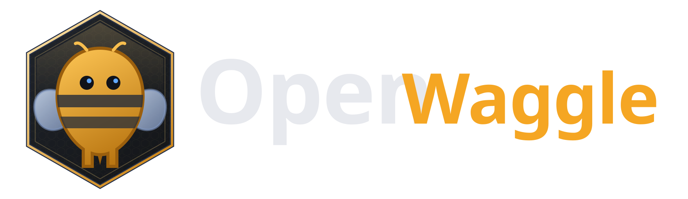
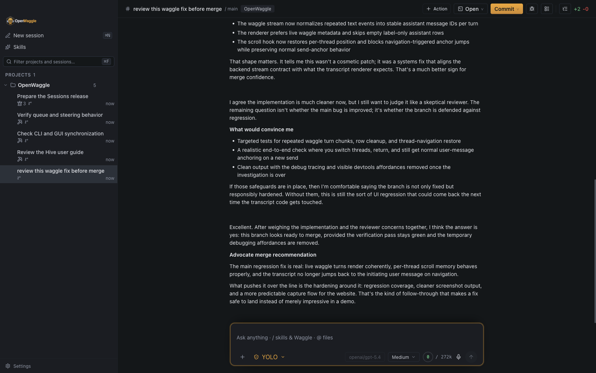

<p align="center">
  
</p>

<p align="center">
  <strong>A desktop app for working on code with AI agents.</strong>
  <br />
  <a href="https://openwaggle.ai">Website</a> &middot; <a href="https://openwaggle.ai/docs/getting-started/first-run">Get started</a> &middot; <a href="https://github.com/OpenWaggle/OpenWaggle/releases">Download</a>
</p>

Ask questions about a project, request changes, and review the results. OpenWaggle brings the conversation, code diffs, a terminal, and a browser preview into one app for macOS, Windows, and Linux.



## Install

[Download OpenWaggle from GitHub Releases](https://github.com/OpenWaggle/OpenWaggle/releases).

- **macOS:** choose the `.dmg` for Apple Silicon or Intel.
- **Windows:** use the `.exe` installer.
- **Linux:** use the `.AppImage`.

On macOS and Linux, you can also use the installer script:

```bash
curl -fsSL https://raw.githubusercontent.com/OpenWaggle/OpenWaggle/main/scripts/install.sh | bash
```

See [Installation](https://openwaggle.ai/docs/getting-started/installation) for platform-specific steps, unsigned-app warnings, and updates.

## Get started

Connect your provider in **Settings → Connections**, enable a model, and open a project folder. Start by asking about the code, then request a small change and inspect the diff.

The [Get started guide](https://openwaggle.ai/docs/getting-started/first-run) walks through setup, approvals, and sending feedback on a change.

You use your own provider account. Its charges and usage limits apply. Sessions and settings are stored locally, but messages and code included in requests to hosted models leave your machine. See [Privacy and data](https://openwaggle.ai/docs/configuration/security-privacy).

## Documentation

- [Reviewing changes and Git](https://openwaggle.ai/docs/developer-workflow/git-integration)
- [Browser preview and visual feedback](https://openwaggle.ai/docs/developer-workflow/browser-preview)
- [Conversation branches](https://openwaggle.ai/docs/using-openwaggle/session-tree)
- [Providers and models](https://openwaggle.ai/docs/providers/overview)
- [Project instructions](https://openwaggle.ai/docs/extending/agents-md), [skills](https://openwaggle.ai/docs/extending/skills-system), and [MCP connections](https://openwaggle.ai/docs/configuration/mcp)

For tasks that benefit from multiple agents, [Hives](https://openwaggle.ai/docs/using-openwaggle/hives-and-sessions) coordinate separate worker sessions. [Waggle](https://openwaggle.ai/docs/using-openwaggle/waggle-mode) lets two agents take turns in one conversation. Both are optional.

## Contributing

Bug reports, documentation feedback, and feature requests are welcome through [GitHub Issues](https://github.com/OpenWaggle/OpenWaggle/issues). Code pull requests are not currently accepted; see [Contributing](CONTRIBUTING.md).

- [Build from source](https://openwaggle.ai/docs/developer-guide/building-from-source)
- [Architecture](docs/architecture.md)
- [Project roadmap](https://github.com/orgs/OpenWaggle/projects/1)

---

Built on [Pi](https://pi.dev/).
