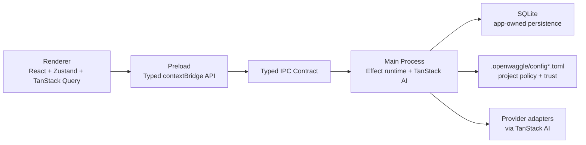

# Architecture

OpenWaggle now uses an Effect-first main-process architecture with a hybrid persistence model:

- Effect owns runtime composition, typed errors, boundary validation, and stream control flow in the Electron main process.
- TanStack AI remains the model/tool runtime boundary.
- SQLite is the source of truth for app-owned state.
- `.openwaggle/config.toml` and `.openwaggle/config.local.toml` remain the source of truth for project-authored policy and trust.

This is intentionally close to the architecture style used by T3Code, while keeping the OpenWaggle-specific choices that are stronger for this product surface.

## Core Principles

- Keep one runtime owner in main: `Effect`.
- Keep one model/tool owner in chat: `TanStack AI`.
- Keep one typed process contract: [`src/shared/types/ipc.ts`](../src/shared/types/ipc.ts).
- Keep project policy local and explicit on disk.
- Keep destructive actions fail-closed.

## Process Model

## Main Runtime

The main-process composition lives in [`src/main/runtime.ts`](../src/main/runtime.ts).

- `AppLayer` composes the live services.
- `ManagedRuntime` is the single bridge from Electron callbacks into Effect.
- IPC handlers use `typedHandleEffect(...)` so validation and tagged failures cross the Electron boundary cleanly.

Current core live services:

- [`src/main/services/logger-service.ts`](../src/main/services/logger-service.ts)
- [`src/main/services/provider-registry-service.ts`](../src/main/services/provider-registry-service.ts)
- [`src/main/services/database-service.ts`](../src/main/services/database-service.ts)

This mirrors the T3Code pattern of small tagged services composed through layers, rather than global runtime state hidden behind ad hoc imports.

## IPC Boundary

[`src/main/ipc/typed-ipc.ts`](../src/main/ipc/typed-ipc.ts) is the Effect-aware Electron boundary.

- Shared channel types still live in [`src/shared/types/ipc.ts`](../src/shared/types/ipc.ts).
- Handler arguments and return values stay typed end to end.
- Effect failures are translated once into readable IPC errors.
- No casts are used to force handler compatibility.

That keeps OpenWaggle’s IPC contract stricter than the more server-centric request wiring used in T3Code.

## Validation

Effect Schema is now the runtime validation system across shared and main boundaries.

- Shared helpers live in [`src/shared/schema.ts`](../src/shared/schema.ts).
- Shared schemas live under [`src/shared/schemas/`](../src/shared/schemas/).
- Main-process parsers decode external or persisted input through Effect Schema helpers instead of Zod.

This matches the T3Code preference for a single validation model that also composes with Effect error handling.

## Agent Runtime

The agent loop in [`src/main/agent/agent-loop.ts`](../src/main/agent/agent-loop.ts) now uses Effect-owned control flow for:

- stream setup
- stall waiting
- retry delay scheduling
- cancellation propagation
- lifecycle error handling

### Tool execution

OpenWaggle intentionally keeps one design choice that is better than an ambient context service:

- built-in tools are bound to an explicit `ToolContext` per run through [`src/main/tools/define-tool.ts`](../src/main/tools/define-tool.ts)
- no `AsyncLocalStorage` remains in the tool runtime
- tool implementations still receive a typed context argument directly

This preserves T3Code’s “typed runtime state, not hidden globals” goal while fitting the TanStack server-tool execution model more naturally.

## Persistence

SQLite bootstrap and migrations live in [`src/main/services/database-service.ts`](../src/main/services/database-service.ts).

App-owned state now lives in SQLite:

- settings
- auth tokens
- conversations and message parts
- orchestration events and read models
- team presets
- team runtime state

Project-owned policy remains file-backed:

- `.openwaggle/config.toml`
- `.openwaggle/config.local.toml`

This is the same broad architectural split T3Code uses between durable runtime persistence and explicit project-state files, with OpenWaggle keeping local trust/config as a first-class repo concept.

## T3Code Alignment

The parts deliberately aligned with T3Code:

- Effect `Layer` + tagged-service composition
- Effect-owned runtime boundary in the server/main process
- Effect Schema at runtime boundaries
- SQLite-backed orchestration persistence
- event-store plus read-model split for orchestration data

The parts deliberately different:

- TanStack AI remains the chat/tool execution engine instead of a provider-native orchestration runtime
- Electron typed IPC stays the primary contract instead of HTTP/RPC endpoints
- project trust/config stays in `.openwaggle/config*.toml`
- renderer runtime stays React + Zustand + TanStack Query without an Effect renderer runtime

## Source Map

- Runtime: [`src/main/runtime.ts`](../src/main/runtime.ts)
- IPC bridge: [`src/main/ipc/typed-ipc.ts`](../src/main/ipc/typed-ipc.ts)
- Agent loop: [`src/main/agent/agent-loop.ts`](../src/main/agent/agent-loop.ts)
- Stream control: [`src/main/agent/stream-processor.ts`](../src/main/agent/stream-processor.ts)
- Tool boundary: [`src/main/tools/define-tool.ts`](../src/main/tools/define-tool.ts)
- SQLite layer: [`src/main/services/database-service.ts`](../src/main/services/database-service.ts)
- Shared schema helpers: [`src/shared/schema.ts`](../src/shared/schema.ts)
