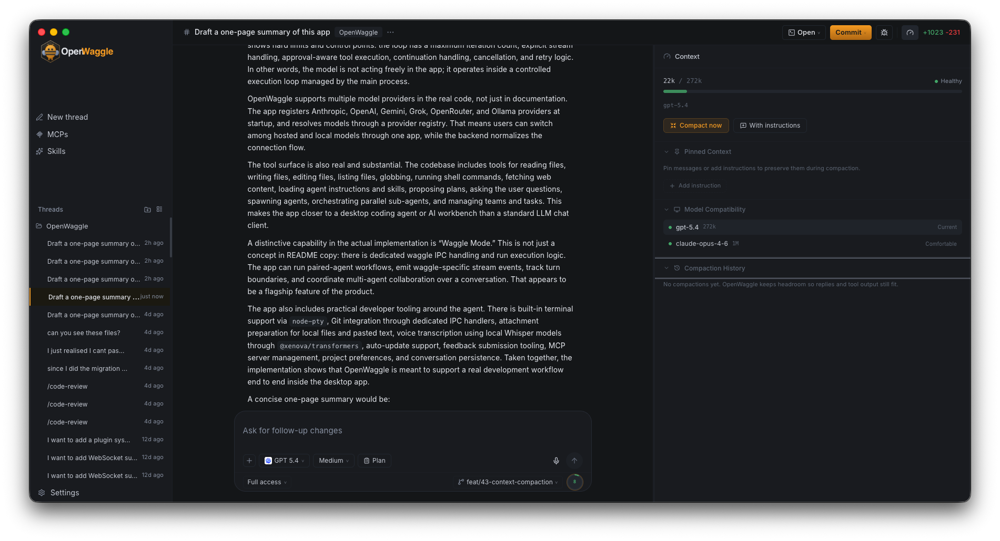

# Context Management

## What is Context?

Every AI model has a **context window** — a limit on how much information it can process at once. This includes your conversation history, the system prompt, tool definitions, project instructions, and skills. As your conversation grows, it uses more of this window.

OpenWaggle makes this visible. You always know how full the context is, what's using it, and what happens when it gets full.



## Context Meter

The **radial meter** in the bottom-right of the composer shows your current context usage as a percentage. The number inside tells you how much of the model's context window is in use.

- **Green** — Healthy. Plenty of room.
- **Yellow** — Elevated. Getting fuller.
- **Red** — Near the limit or over.

The meter is always live. Even before you send a message, it shows the baseline usage from the system prompt, tools, and MCP servers.

**Click the meter** to open the Context Inspector. Click again to close it.

## Context Inspector

The inspector opens as a right-side panel (same slot as the diff panel — only one is open at a time). You can also toggle it from the header icon next to the diff stats.

### Overview

The top section shows:

- **Token usage** — e.g., `24k / 1M` with a proportional bar
- **Health status** — Healthy, Elevated, Near limit, or Over limit
- **Current model** — The model selected in the composer dropdown
- **Pinned count** — How many items are pinned and their token cost
- **Last compaction** — When it happened and how much was freed
- **Microcompaction** — How many old tool results were cleared (this happens automatically on every message to keep tool output from bloating the context)

### Actions

- **Compact now** — Run compaction immediately using the default policy
- **With instructions** — Prefills `/compact` in the composer so you can type specific instructions about what to preserve

### Sections

- **Pinned Context** — View and manage pinned items (see below)
- **Model Compatibility** — See all enabled models with their context windows and compatibility status. Click a model to switch. Risky switches show a confirmation dialog. Blocked models are disabled.
- **Compaction History** — Recent compaction events with timestamps and token impact
- **Waggle Context** — When waggle mode is active, shows participating models and which one governs the context budget (the smallest window)

## Compaction

When a conversation gets large, compaction summarizes older messages to free up space. OpenWaggle uses a layered approach:

### Tier 1: Microcompaction (Automatic)

On every message, old tool results (file reads, command outputs) are replaced with compact placeholders. The 5 most recent tool results are kept intact. This is invisible in the chat but visible in the inspector as "X old tool results cleared."

In typical coding sessions, tool results (file contents, command outputs, search results) consume 60-80% of the context window. Microcompaction strips the stale ones, resulting in roughly **20-60% context reduction** depending on how tool-heavy the conversation is.

### Tier 2: Full Compaction (LLM-Based)

When the conversation reaches **90% of the context window**, an LLM summarizes the older part of the conversation into a handoff summary. Recent messages and the last assistant response are preserved in full.

Full compaction creates a visible **inline event** in the chat timeline showing what happened and how many tokens were freed.

### Reactive Compaction (Safety Net)

If our token estimate was slightly off and the AI provider rejects the request because the context is too large, OpenWaggle catches the error, compacts the conversation, and retries automatically. You see a brief delay but your message goes through.

### Manual Compaction

You can compact anytime — you don't have to wait for the automatic trigger.

**From the inspector:** Click **Compact now** to run with the default policy, or **With instructions** to specify what to preserve.

**From the composer:** Type `/compact` and send. Add instructions after the command:

```
/compact preserve the auth module analysis and the API design decisions
```

The `/compact` command does not create a chat message. It runs as a control action and the result appears as an inline compaction event.

### Save for Thread

When typing a `/compact` command with instructions, a **Save for thread** toggle appears in the toolbar (next to the Plan button). When enabled, your instructions become permanent guidance for this conversation — every future compaction (manual or automatic) will follow them.

This is useful for long-running threads where certain context always matters:

```
/compact always preserve the migration plan and the database schema decisions
```

Toggle **Save for thread** on before sending, and that instruction applies to every compaction in this thread going forward.

## Pinned Context

Pin important messages or instructions so they survive compaction with the highest priority.

### How to Pin

- **From chat** — Hover over any user or assistant message and click the pin icon
- **From the inspector** — Open the Pinned Context section and click **Add instruction** to pin custom text

Pinned items are shown in the inspector with their type (message or instruction) and estimated token cost.

### Preservation

Pinned content receives the highest preservation priority during compaction. The compaction LLM is instructed to keep pinned content verbatim in the summary.

Under extreme context pressure (>95% even after compaction), pinned content may be summarized as a last resort. When this happens, it's flagged in both the chat timeline and the inspector.

### Managing Pins

Open the **Pinned Context** section in the inspector to see all pins. Each pin shows its type, content preview, and token estimate. Click the trash icon to remove a pin.

## Model-Switch Safety

Different models have different context windows. Switching from a 1M model to a 200K model mid-conversation could be a problem if you've already used more than 200K tokens.

The **Model Compatibility** section in the inspector shows every enabled model with a status:

- **Comfortable** — Plenty of room
- **Tight fit** — Fits but it's close
- **Would compact** — Switching would require compaction (shows a confirmation dialog)
- **Blocked** — Context exceeds this model's window entirely (disabled)

You can switch models directly from the inspector. Safe switches happen immediately. Risky ones ask for confirmation first.

The composer's model dropdown also shows context window sizes next to each model name (e.g., "1M", "200k").

## Waggle Mode

When waggle mode is active with multiple models, the **smallest context window** among participants governs compaction behavior. If one model has 200K and another has 1M, compaction triggers based on the 200K window.

The inspector's **Waggle Context** section shows all participating models and highlights which one is the governing model.

## Tips

- **Check the meter before long tool chains** — if you're about to ask the agent to read many files, check how full the context is first
- **Pin early** — if a message contains a critical decision or analysis, pin it right away rather than hoping compaction preserves it
- **Use `/compact` with instructions** when you know what matters — the default policy is good but your domain knowledge is better
- **Save guidance for thread** on long-running implementation threads — set it once and every future compaction respects it
- **Watch the inline events** — when compaction happens, the chat timeline shows exactly what changed so you can verify nothing important was lost
