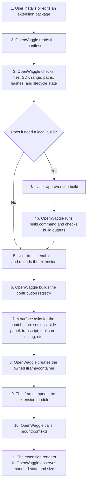

OpenWaggle extensions are local packages that can add OpenWaggle desktop contributions and optionally include Pi runtime resources.

The extension host is being implemented under issue #113. This page documents the target author contract so extension packages, QA fixtures, and agents use the same vocabulary while the implementation lands.

## Basic Extension How-To

A basic extension is a directory with an `openwaggle.extension.json` manifest and one or more declared runtime files.

For a project-local install, place it under the project:

```text
my-project/
  .openwaggle/
    extensions/
      example-extension/
        openwaggle.extension.json
        modules/
          settings.js
          side-panel.js
        package.json
```

The directory name must match the manifest `id`. Global extensions are discovered from OpenWaggle's app-data `extensions/` directory and should normally be managed by the Extension Manager when that install UI exists.

Create the manifest first:

```json
{
  "manifestVersion": 1,
  "id": "example-extension",
  "name": "Example Extension",
  "version": "0.1.0",
  "description": "A small extension with settings and a side panel.",
  "sdk": {
    "openwaggle": ">=0.1.0 <0.2.0"
  },
  "sourceFiles": ["package.json", "src/settings.js", "src/side-panel.js"],
  "builtArtifacts": ["package.json", "modules/settings.js", "modules/side-panel.js"],
  "install": {
    "source": "prebuilt"
  },
  "capabilities": [
    {
      "id": "openwaggle.storage",
      "methods": ["get", "set", "list"],
      "scopes": ["project"]
    }
  ],
  "contributions": {
    "settingsSections": [
      {
        "id": "example.settings",
        "title": "Example Settings",
        "runtime": "federated-module",
        "execution": "host-renderer",
        "entry": "modules/settings.js",
        "capability": "openwaggle.storage",
        "methods": ["get", "set", "list"]
      }
    ],
    "sidePanels": [
      {
        "id": "example.panel",
        "title": "Example Panel",
        "runtime": "federated-module",
        "execution": "host-renderer",
        "entry": "modules/side-panel.js",
        "capability": "openwaggle.storage",
        "methods": ["get", "list"]
      }
    ]
  }
}
```

Then build or copy the entry modules listed in `builtArtifacts`. A federated-module entry exports `mount(context)`:

```js
export async function mount(context) {
  const root = document.createElement('section')
  root.textContent = `Mounted ${context.contribution.id}`
  context.root.append(root)

  return () => {
    root.remove()
  }
}
```

The lifecycle for a user or agent is:

1. Create or copy the package directory into `<project>/.openwaggle/extensions/<extension-id>/`.
2. Ensure `openwaggle.extension.json` lists every source file, built artifact, capability, network origin, runtime requirement, and contribution.
3. If `install.source` is `prebuilt`, ship the built files already present in `builtArtifacts`.
4. If `install.source` is `local-build`, declare `build.command` and `build.outputs`, then use Settings > Extensions to approve and run the build.
5. Open Settings > Extensions and refresh discovery.
6. Inspect the package path, SDK range, content hash, install source, build command, capabilities, network origins, trusted local code, and diagnostics.
7. Trust the extension. Trust pins the current package identity, SDK range, version, and content hash.
8. Enable the extension.
9. Reload the extension registry so eligible contributions can appear on their surfaces.
10. Update the extension by replacing package files and bumping the version. OpenWaggle treats the changed content hash as an explicit update; approve the update, then enable and reload again if the update flow disables runtime loading.
11. Disable the extension from Settings > Extensions to stop all contributions without deleting files. For global extensions, use project availability controls to disable only one project.
12. Remove the extension from runtime discovery by disabling it, untrusting it when appropriate, deleting its package directory, and refreshing Settings > Extensions. Future Extension Manager remove UI should perform the same package removal plus any explicit user-approved cleanup of lifecycle or extension-owned storage records.

## Model

OpenWaggle is manifest-first. The manifest is the contract the host reads before running extension code. If a contribution, capability, file, network origin, runtime requirement, or build step is not declared in the manifest, OpenWaggle should not treat it as available at runtime.

An extension package can declare multiple contribution families:

- `settingsSections` for Settings content owned by the extension.
- `sidePanels` for right-side or auxiliary panels.
- `dialogs` for host-owned modals and dialog content.
- `routes` for extension-owned route content inside an OpenWaggle route container.
- `transcriptRenderers` for durable transcript rendering.
- `toolRenderers` for Pi-native tool call/result cards.
- `customMessageRenderers` for Pi custom message records.
- `interactionRenderers` for Pi interaction requests such as `confirm`, `select`, `input`, `editor`, `notify`, and typed custom interactions.
- `statusWidgets` for compact status surfaces.
- `commands` and `slashCommands` for command palette and composer-adjacent launchers.

OpenWaggle owns the container: placement, chrome, sizing, docking, fallback behavior, and persistence rules. The extension owns the content mounted inside that container.

Visual contributions use the federated module runtime. The extension exports `mount(context)` from its entry module. The module can use React, Vue, Preact, Svelte, plain DOM, or another UI stack. The required contract is the mount context, not a framework.

Composer-adjacent contributions are compact actions, slash commands, or launchers. They can open host-owned dialogs, side panels, or interaction surfaces, but they must not inject arbitrary input controls into the composer text flow.

## How An Extension Appears On Screen

Think of an extension like a toy that needs a safe play table.

OpenWaggle owns the table: where the extension appears, how big the container is, when it can run, and which APIs it can call. The extension owns the toy: the UI and behavior inside that container.



The important split is:

- OpenWaggle decides whether the extension is allowed to render.
- OpenWaggle creates and sizes the container.
- The extension decides what to render inside `mount(context)`.
- The extension can render immediately or show its own skeleton while it does async work.

## Readiness And Loading

An extension contribution is ready to be rendered only after all lifecycle checks pass:

- manifest schema is valid
- referenced files exist
- SDK range is compatible
- content hash matches the trusted pin
- local build is approved and succeeded, when required
- extension is trusted
- extension is enabled
- extension has been reloaded after the last trust, enable, build, or update change
- project opt-outs do not block the current project

OpenWaggle builds the contribution registry from that state. The registry is the menu of extension contributions that the app can actually use. If a contribution is not in the registry, the UI treats it as unavailable and uses an OpenWaggle-owned fallback when one exists.

Mount readiness is separate from registry readiness:

- Registry readiness means OpenWaggle knows the contribution is allowed and available.
- Mount readiness means the iframe loaded the module and the module's `mount(context)` function resolved.

OpenWaggle shows a generic mounting state only until `mount(context)` resolves. If an extension needs to fetch data, call storage, or wait for a network API, it should render a lightweight shell or skeleton first and continue the async work after the initial render.

## Local Builds

Most extensions can ship already-built JavaScript in `builtArtifacts`. Those extensions do not compile at render time.

Extensions that need a local build declare it in the manifest:

```json
{
  "install": {
    "source": "local-build"
  },
  "build": {
    "command": "pnpm build",
    "outputs": ["dist/index.js"]
  },
  "builtArtifacts": ["dist/index.js"]
}
```

Local builds are intentionally explicit:

- The user approves the build before OpenWaggle runs it.
- The command runs in the extension package directory.
- OpenWaggle stores the build status and a capped build log.
- Build outputs must also be listed in `builtArtifacts`.
- A failed build blocks the extension from being trusted/enabled for runtime use.
- Changing source files changes the build-plan hash, so the build must be approved again.

Build time is whatever the extension's build command takes. Runtime rendering does not run that build again.

## Trust And Capabilities

OpenWaggle extensions are trusted local software after explicit user approval. Trust is not implied by package discovery.

Before trust, OpenWaggle reads the manifest, validates declared files, checks SDK compatibility, calculates the content hash, checks runtime requirements, and shows diagnostics. After trust, runtime loading is still gated by enablement, update state, build status, reload status, project opt-outs, and contribution-level eligibility.

The trust review should make these privileges visible:

- Trusted renderer modules: federated-module entries can run inside OpenWaggle-owned contribution containers after trust, enablement, and reload.
- Trusted local main code: manifests may declare trusted local main code when the extension needs host-side behavior. This is privileged local code and should require explicit trust.
- Network access: `network.origins` declares external origins such as `https://api.github.com`. Undeclared network origins should not be treated as approved.
- Build scripts: `install.source: "local-build"` plus `build.command` asks the user to run local code during build. Build approval is separate from runtime trust.
- External runtime requirements: `runtimeRequirements` declares required binaries or commands. Missing requirements block trust or runtime eligibility until fixed.
- Brokered capabilities: `capabilities` declares SDK capabilities, methods, and scopes such as `openwaggle.storage` with `get`, `set`, and `list` for `project` scope.

Trust pins the current package content hash. Editing manifest files, source files, built artifacts, or the build plan changes the hash and creates an explicit update path. Extension updates are user-approved; they are not silent runtime swaps.

## State And Actions

Extensions must not import writable OpenWaggle stores, renderer feature internals, Pi SDK internals, or Electron app internals. They use the public SDK and brokered capabilities.

The state model is:

- OpenWaggle state is read-only through typed capabilities such as `openWaggle.state.get(scope)`.
- OpenWaggle mutations use typed action capabilities such as `openWaggle.actions.selectProject(scope, projectPath)`.
- Settings access uses typed settings capabilities such as `openWaggle.settings.get(scope)` and `openWaggle.settings.update(scope, settings)`.
- Extension package state is extension-owned and can be shared by every contribution from the same package.
- `storage.packageState.global` and `storage.packageState.project` are for persistent package state.
- `storage.packageConfig.global` and `storage.packageConfig.project` are for persistent package configuration.
- Contribution instance state stays local to one mounted contribution and should not be required to reconstruct historical transcript rendering.
- Pi session data remains the durable source of truth for historical agent-loop records.

Use package state when settings, side panels, transcript renderers, tool renderers, interaction renderers, and status widgets from the same extension need to coordinate. Use instance state for temporary UI state such as focused tabs, expanded rows, or an in-progress form in one mounted surface.

## Safe Startup And Failure Isolation

Extension failures must not prevent OpenWaggle from starting.

Expected failure behavior:

- Invalid manifests, missing files, incompatible SDK ranges, missing runtime requirements, failed builds, and stale trust pins become diagnostics and keep the affected package or contribution out of the contribution registry.
- A failed contribution registration does not remove unrelated contributions from other extensions.
- A failed mount is isolated to that contribution container where practical.
- Standard Pi interaction primitives keep OpenWaggle-owned fallback UI so tools do not hang when a custom renderer is unavailable.
- A `custom` Pi interaction without a matching desktop renderer shows an explicit unsupported-interaction fallback with a reject action instead of silently waiting forever.
- Disable, untrust, project-disable, approve update, approve build, and reload controls remain OpenWaggle-owned recovery paths.
- Extensions should mount a lightweight shell quickly, then perform slower work such as storage reads or network requests after initial render.

## What Can Make Loading Feel Slow

The fastest path is a prebuilt local module that renders immediately from cached state. That should usually feel near-instant.

Loading can take longer when:

- the extension has not been trusted, enabled, or reloaded yet
- a local build is required
- the extension changed and needs update approval
- many extension roots or project scopes must be discovered
- the module is large or imports a large UI framework
- the extension performs async work inside `mount(context)`
- the extension fetches network data
- dev mode is running Vite/Electron rebuilds or stale main-process CSP state

The extension author controls the experience after `mount(context)` starts. If the extension has slow work, it should render a useful initial state first, then update when the async work finishes.

## Pi Runtime Parity

Runtime behavior stays Pi-native.

Use Pi extension APIs for tools, runtime resources, session hooks, and user interaction. OpenWaggle provides desktop renderers for those Pi events instead of creating a separate OpenWaggle tool runtime.

Common Pi APIs used by extensions include:

- `pi.registerTool()` for LLM-callable tools
- `renderCall` and `renderResult` for Pi TUI tool rendering
- `pi.registerMessageRenderer()` for Pi TUI custom messages
- `ctx.ui.confirm()`, `ctx.ui.select()`, `ctx.ui.input()`, `ctx.ui.editor()`, `ctx.ui.notify()`, and `ctx.ui.custom()` for user interaction

OpenWaggle desktop renderers bind to Pi-native identifiers such as tool names, custom message types, standard interaction kinds, and custom interaction types. This keeps Pi TUI and OpenWaggle desktop rendering aligned to the same runtime event.

## Agent-Loop Contributions

Agent-loop contributions render or collect feedback during an active Pi agent loop.

They can be display-only, such as a tool progress card, or interactive, such as an approval dialog. Interactive contributions return typed responses to the pending Pi interaction through OpenWaggle's brokered extension path.

A contribution should bind to a Pi-native identity:

```json
{
  "contributions": {
    "toolRenderers": [
      {
        "id": "github.issue-tool-card",
        "title": "GitHub Issues Tool Card",
        "runtime": "federated-module",
        "execution": "host-renderer",
        "entry": "dist/github-issue-tool-card.js",
        "matches": {
          "toolNames": ["openwaggle.github.listIssues"]
        },
        "capability": "openwaggle.storage",
        "methods": ["get", "list"]
      }
    ]
  }
}
```

A single Pi tool or custom message can have multiple OpenWaggle renderers across different surfaces. The transcript is the durable audit trail; dialogs, side panels, status widgets, and composer actions are auxiliary live surfaces.

## Interaction Primitives

OpenWaggle supports Pi interaction primitives as public typed request/response schemas.

Standard primitives have OpenWaggle-owned fallback UI:

- `confirm`: prominent confirmation UI plus transcript record
- `select`: choice UI plus transcript record
- `input`: short text input UI plus transcript record
- `editor`: multiline editor UI plus transcript record
- `notify`: notification/status UI, with transcript record when relevant

`custom` is the escape hatch for interactions that do not fit the standard primitives. OpenWaggle does not execute Pi TUI components inside Electron. A custom interaction needs a matching desktop renderer, or OpenWaggle shows an unsupported-interaction fallback with a reject action instead of silently hanging the tool.

Interaction renderer matching uses:

- standard primitives: `matches.interactionKinds` values such as `confirm`, `select`, `input`, `editor`, and `notify`
- custom interactions: `matches.interactionKinds` set to the interaction `customType`

Renderer modules return responses by calling `sdk.surface.respondInteraction(response)`. For standard primitives, `response` must match the public interaction response schema, for example `{ "kind": "confirm", "accepted": true }`. For custom interactions, the response value is passed back as the custom interaction result.

## Public Data Boundary

Extension renderer modules receive OpenWaggle public DTOs, not Pi package types or OpenWaggle renderer internals.

DTOs preserve Pi semantics such as:

- tool name
- custom message type
- tool call id
- interaction id
- input parameters
- partial and final result state
- structured details
- error state
- session and project identity

Do not import OpenWaggle stores, renderer feature internals, Pi SDK internals, or Electron app internals from visual contribution modules. Use the public extension SDK surface and brokered capabilities.

## State

Pi session data is the durable source of truth for historical agent-loop rendering.

Extension package state can coordinate live surfaces from the same package. Contribution instance state can hold UI-local details for one mounted contribution. Persistent extension data must use typed storage capabilities.

Historical transcript entries must be reconstructable from the mount context and Pi session data after remount, route change, or app restart.

## What Requires An OpenWaggle App Update

Extension authors can ship independently when they stay inside the existing public contract:

- Add or change manifest-declared contributions in existing families.
- Add or update federated-module renderer entries that still export `mount(context)`.
- Add assets, CSS, package-local docs, and built artifacts declared in the manifest.
- Add or change Pi-native tools, custom messages, resource roots, and runtime behavior supported by Pi and declared in the extension package.
- Add or change usage of existing brokered SDK capabilities, methods, and scopes already supported by the installed OpenWaggle SDK.
- Add or change package-owned storage keys and package-owned configuration.
- Add or remove declared network origins, local build commands, or runtime requirements, subject to user approval.

An OpenWaggle app update is required when the extension needs a new host contract:

- A new contribution family or a new host-owned surface/container.
- A new visual runtime besides `federated-module`.
- A new execution placement besides the supported placements.
- A new SDK capability, method, scope, DTO shape, action, or settings schema.
- A new fallback renderer for an OpenWaggle-owned standard interaction primitive.
- A new Pi interaction primitive that OpenWaggle must understand as a first-class desktop interaction.
- A change to extension trust semantics, package discovery roots, content-hash calculation, network approval, CSP/protocol behavior, or build approval rules.
- A packaged-app distribution change, such as shipping a first-party extension as production content or changing how installed OpenWaggle and Pi docs are generated.

If the installed app reports `sdk.openwaggle` as incompatible, the extension cannot fix that by changing runtime code alone. Either the extension must target the installed SDK range or the user must update OpenWaggle.

## Development Fixture

The development-only GitHub Issues Overview fixture is the proving extension for the vertical slice.

It should demonstrate:

- settings and side-panel contributions sharing package state
- a Pi-native tool such as `openwaggle.github.listIssues`
- standard Pi interactions such as `confirm`
- a custom desktop interaction or transcript tool renderer
- fallback behavior when the custom renderer is disabled or unavailable

Development fixtures live under `fixtures/extensions/`. They are for tests, demos, and local QA only, and must not be shipped as product content.

Use `pnpm extension:qa:install` to copy fixture packages into the current checkout's project-local `.openwaggle/extensions/` directory for QA. That command is a development helper, not a production packaging step.

## Agent-Discoverable Installed Docs

This page is the repository source of truth for OpenWaggle extension authoring. Packaged builds should derive Pi-style package-local docs from the full user-facing documentation set so self-modifying agents can inspect installed OpenWaggle product, extension, and runtime contracts without relying on a source checkout.

Do not maintain separate hand-written copies for agents. If installed package-local docs diverge, fix the build copy step or the source documentation.

Generated installed docs must be easy to navigate:

- A root `README.md` explains what the docs bundle contains and where it was generated from.
- A topic index maps common questions to stable paths, such as extensions, tools, interactions, sessions, settings, providers, MCP, Pi runtime, and QA fixtures.
- OpenWaggle docs and Pi docs are grouped predictably, so agents do not need to inspect the package layout by trial and error.
- Important extension authoring entries should have obvious aliases or index links for manifest schema, SDK surface, agent-loop contributions, interaction schemas, and federated module mounting.

Agents should resolve installed docs through a typed docs discovery capability instead of hardcoding source or packaged paths. The same topic map should be available to extension code and to OpenWaggle's self-modifying agent context. The generated index is the manual fallback for tools that only have filesystem access.

Docs discovery should return lightweight metadata rather than file content by default:

```typescript
{
  topic: 'openwaggle.extensions.agentLoop',
  title: 'Agent-loop contributions',
  path: '/path/to/openwaggle/docs/extending/openwaggle-extensions.md',
  anchors: ['agent-loop-contributions', 'interaction-primitives'],
  aliases: ['tool renderers', 'transcript cards'],
  keywords: ['ctx.ui.confirm', 'Pi tools', 'custom interaction'],
  source: 'openwaggle'
}
```

First-party topics should be closed and typed so generated indexes and SDK calls can be validated. Extension packages can also ship Pi-style package-local docs in `docs/`. Those docs are exposed through a structured extension namespace with provenance metadata and cannot override first-party OpenWaggle or Pi topics. Extension docs are discoverable regardless of trust or enablement; trust and lifecycle state are metadata, not visibility gates.

```typescript
{
  source: 'extension',
  extensionId: 'openwaggle-github-issues-overview',
  topic: 'configuration'
}
```

## Local Pi Reference

Agents and developers can inspect the installed Pi docs in a checkout for exact Pi runtime semantics:

- `node_modules/@earendil-works/pi-coding-agent/docs/extensions.md`
- `node_modules/@earendil-works/pi-coding-agent/docs/rpc.md`
- `node_modules/@earendil-works/pi-coding-agent/docs/sdk.md`
- `node_modules/@earendil-works/pi-coding-agent/docs/tui.md`

OpenWaggle docs define how those Pi concepts are exposed in the desktop product.
